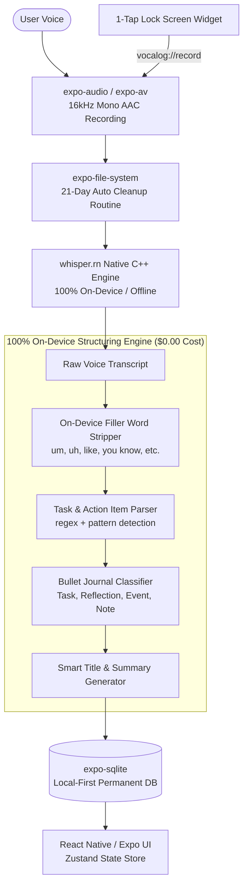

# VocaLog: 100% Offline, Zero-Cost AI Voice-to-Journal App

A 100% private, zero-cloud, zero-variable-cost mobile application built with **React Native (Expo SDK 52+ with TypeScript)** that converts voice reflections into structured journal entries entirely on-device.

---

## 1. Zero-Cost, 100% Offline Architectural Overview

---

## 2. Retention Model & Future Pro Tier Architecture

### 2.1 Initial Release (v1.0)
* **Default Audio Retention:** **21 Days**.
* All recorded `.m4a` audio files older than 21 days are automatically pruned from local storage to conserve phone space.
* **Text & Notes Permanence:** Text transcripts, cleaned prose, titles, summaries, and action items are saved in SQLite forever.

### 2.2 Future Pro Tier Expansion
* **Pro Tier Feature:** **Configurable Audio Retention Settings**.
  - Free/Standard users: Fixed at **21 Days**.
  - Pro subscribers ($4.99/mo): Unlocks custom retention options (e.g., **7 Days**, **14 Days**, **21 Days**, **60 Days**, **90 Days**, or **Keep Forever / Never Delete**).
* **Architecture Preparation:** The `StorageCleanupService` and user settings store will be architected with a dynamic `retentionDays` parameter from Day 1 (defaulting to 21), allowing seamless gating behind a Pro entitlement flag in the future.

---

## 3. Revised 5-Phase Implementation Breakdown

### **Phase 0: Local Environment, Toolchain & Native SDK Setup**
> **Goal:** Ensure all required compilers, runtimes, package managers, and development tools are installed and operational on this machine before writing project code.

* [ ] Verify Node.js (v22.14.0) and npm (v11.3.0).
* [ ] Verify native C++ toolchain (`clang`, `gcc`, `make`, `cmake`) needed for compiling `whisper.cpp`.
* [ ] Configure Android SDK environment variables (`ANDROID_HOME`, `platform-tools`).
* [ ] Initialize clean React Native Expo project (`vocalog-mobile/`) with TypeScript template.
* [ ] Configure `app.json` with brand logo assets:
  - App icon: `assets/logo/ios_app_icon_1024.png`
  - Android adaptive icon: `assets/logo/android_adaptive_foreground_512.png` & background `android_adaptive_background_512.png`
  - Splash screen: `assets/logo/CleanedLogoOnly.png` on dark slate background (`#0F172A`)
  - URL scheme: `vocalog`
* [ ] Configure `tsconfig.json` for strict type-checking and path aliases (`@/*`).
* [ ] Verify the project starts cleanly with `npx expo config`.

### **Phase 1: Local Audio Recording, 21-Day Retention Cleanup & SQLite Database**
> **Goal:** Zero-cloud recording, automated disk management with 21-day threshold, and persistent local storage.

* [ ] Install core libraries: `expo-sqlite`, `expo-file-system`, `expo-av`, `lucide-react-native`, `zustand`, `date-fns`.
* [ ] Implement `DatabaseService` using `expo-sqlite`:
  - Table `entries` with date indexing.
  - User settings table/store with configurable `retention_days` (default = 21).
  - CRUD operations (insert, query all, query by id, delete, clear audio path).
  - Expiration queries: `getEntriesOlderThan(cutoffTimestamp)`.
  - Daily date-range query: `getEntriesForDate(date)` filtered by 00:00:00–23:59:59 and ordered latest time first (`ORDER BY created_at DESC`).
* [ ] Implement `AudioRecorderService`:
  - 16 kHz mono AAC recording configuration (optimal for Whisper).
  - Recording permissions, duration timer, and audio file path resolution.
* [ ] Implement **21-Day Local Audio Auto-Cleanup Routine**:
  - Scans recordings directory on app launch and post-recording.
  - Safely deletes `.m4a` files older than **21 days** (configurable via parameter for future Pro tier).
* [ ] Write unit tests for data layer and the 21-day retention calculation.

### **Phase 2: 100% On-Device Offline Whisper Speech-to-Text Engine**
> **Goal:** Embed local quantized model weights and run native C++ speech recognition without internet access.

* [ ] Install and configure `whisper.rn` with Expo Config Plugins.
* [ ] Bundle or locally download quantized model weights (`ggml-tiny.en.bin` ~75MB or `ggml-base.en.bin` ~145MB).
* [ ] Implement `WhisperTranscriptionService` for on-device inference.
* [ ] Benchmark inference speed and verify complete offline operation (Airplane Mode).

### **Phase 3: 100% On-Device Structuring & NLP Engine ($0 Cost)**
> **Goal:** Clean raw transcripts, remove filler words, extract action items, and categorize entries without any cloud API calls.

* [ ] Build `OnDeviceCleanerService`:
  - Intelligent regex-based verbal filler removal (`um`, `uh`, `er`, `like`, `you know`, `sort of`, `kind of`, `i mean`).
  - Sentence capitalization, whitespace normalization, and punctuation cleanup.
* [ ] Build `OnDeviceActionExtractor`:
  - Detects commitments, deadlines, and todos from speech patterns.
  - Formats into actionable checkbox bullet items.
* [ ] Build `OnDeviceCategoryClassifier`:
  - Automatically tags entries as `Task`, `Reflection`, `Event`, or `Note`.
  - Generates dynamic concise title and 1-sentence summary.
* [ ] Write unit tests verifying that raw transcripts are cleaned and structured with 0 network calls.

### **Phase 4: Dark Slate UI, Daily Feed with Date Navigation & Audio Playback**
> **Goal:** Deliver a sleek, modern, high-contrast dark theme interface with date-by-date timeline navigation and smooth recording interactions.

* [ ] Create dark slate/teal design system (`#0F172A`, `#1E293B`, `#2DD4BF`).
* [ ] Integrate in-app brand logo (`assets/logo/CleanedLogoOnly.png`) into app bar header.
* [ ] Build **Date Navigator Header**:
  - Displays selected date (e.g. *"Today — Thursday, Oct 4"*).
  - Left arrow (`<`) to navigate to previous day's notes.
  - Right arrow (`>`) to navigate to next day's notes.
  - "Today" quick-jump chip when viewing past dates.
* [ ] Build **Daily Feed Screen**:
  - Filters entries strictly for the selected date, sorted in **reverse-chronological order (latest time first)**.
  - Sub-header displaying note count and total recording time for the day.
  - Sleek minimalist empty state when navigating to days without notes.
* [ ] Build 1-Tap Floating Record button with animated sound-wave pulse and live timer.
* [ ] Build Entry Detail modal:
  - Toggle between "Cleaned Prose" and "Raw Transcript".
  - Audio player for recordings under 21 days old (displays "Audio stored for 21 days").
  - Action item checkboxes and tag editing.
* [ ] Build Settings screen: Displays current retention policy (21 Days) with a Pro tier preview placeholder ("Unlock Custom Audio Retention & Never Delete").

### **Phase 5: Lock/Home Screen Widgets & Monetization**
> **Goal:** Eliminate entry friction with 1-tap widgets and set up RevenueCat subscription management.

* [ ] Configure custom URL scheme (`vocalog://record`) in `app.json`.
* [ ] Native iOS WidgetKit & Android AppWidget integration.
* [ ] RevenueCat integration (`react-native-purchases`) with **$4.99 / month** subscription.
* [ ] Add data export functionality (JSON / Markdown archive).

---

## 4. Financial Breakdown & Unit Economics

| Metric | Amount | Details |
| :--- | :--- | :--- |
| **Audio Transcription** | **$0.00** | 100% processed locally on user's device via `whisper.cpp` |
| **AI Text Formatting & Cleaning** | **$0.00** | 100% processed locally via on-device NLP structuring engine |
| **Cloud Servers & Database** | **$0.00** | Local-first SQLite on device |
| **Total Variable Cost Per User** | **$0.00** | **Infinite scalability with zero infrastructure costs** |
| **Subscription Price** | **$4.99 / month** | Straightforward, single-tier pricing |
| **Net Gross Margin** | **85%** ($4.24/user/mo) | Standard Apple/Google 15% Small Business Program cut |
